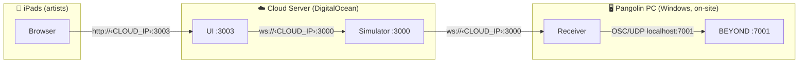
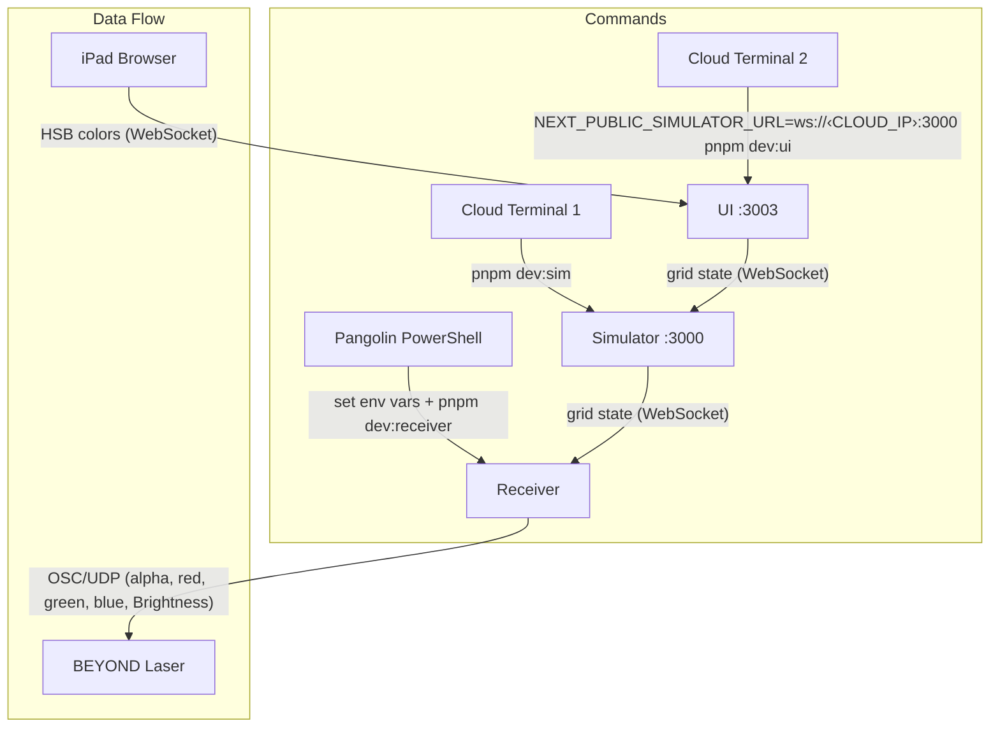

# Event Deployment Guide

## Architecture



**Three devices, three roles:**

| Device | Role | Talks to |
|--------|------|----------|
| **Cloud server** | Runs Simulator + UI | Serves iPads, feeds Receiver |
| **iPads** | Artist interface (browser) | Connects to Cloud UI |
| **Pangolin PC** | Runs Receiver → BEYOND | Pulls from Cloud, sends OSC locally |

---

## Step-by-step

### 1. Cloud Server (Linux)

Open two terminals:

```sh
# Terminal 1 — Simulator (password-protected)
AUTH_PASSWORD=illuminate77! pnpm dev:sim
```

```sh
# Terminal 2 — UI (password-protected, replace CLOUD_IP with your server's public IP)
AUTH_PASSWORD=illuminate77! NEXT_PUBLIC_AUTH_TOKEN=illuminate77! NEXT_PUBLIC_SIMULATOR_URL=ws://<CLOUD_IP>:3000 pnpm dev:ui
```

Ensure ports **3000** and **3003** are open in the firewall.

### 2. Pangolin PC (Windows PowerShell)

#### Single BEYOND target

```powershell
$env:SIMULATOR_URL = "ws://<CLOUD_IP>:3000?token=illuminate77!"
$env:BEYOND_HOST = "127.0.0.1"
$env:BEYOND_PORT = "7001"
$env:SHARD_START = "0"
$env:SHARD_END = "23"
$env:DEBUG_OSC = "1"
pnpm dev:receiver
```

#### Two BEYOND targets (split across two machines)

Use a routing config instead of `BEYOND_HOST`. Save `routing.json` in the repo root (see [examples/routing-two-beyond.json](../examples/routing-two-beyond.json) for a full 49-cannon version):

```json
{
  "targets": {
    "beyond-a": { "type": "beyond", "host": "<BEYOND_A_IP>", "port": 7001 },
    "beyond-b": { "type": "beyond", "host": "<BEYOND_B_IP>", "port": 7001 }
  },
  "flushHz": 30,
  "cannons": [
    { "logical": 0,  "target": "beyond-a", "projectorIndex": 0  },
    { "logical": 1,  "target": "beyond-a", "projectorIndex": 1  },
    { "logical": 2,  "target": "beyond-a", "projectorIndex": 2  },
    ...
    { "logical": 24, "target": "beyond-b", "projectorIndex": 0  },
    { "logical": 25, "target": "beyond-b", "projectorIndex": 1  },
    ...
    { "logical": 48, "target": "beyond-b", "projectorIndex": 24 }
  ]
}
```

Then run:

```powershell
$env:ROUTING_CONFIG = "routing.json"
$env:SIMULATOR_URL = "ws://<CLOUD_IP>:3000?token=illuminate77!"
$env:DEBUG_OSC = "1"
pnpm dev:receiver
```

> Do **not** set `BEYOND_HOST` when using `ROUTING_CONFIG` — they are mutually exclusive.

### 3. iPads

Open Safari and navigate to:

```
http://<CLOUD_IP>:3003
```

---

## Placeholders

Replace these before running:

| Placeholder | Example | Description |
|-------------|---------|-------------|
| `<CLOUD_IP>` | `203.0.113.50` | Public IP of the DigitalOcean droplet |
| `<BEYOND_A_IP>` | `192.168.1.68` | LAN IP of first BEYOND PC |
| `<BEYOND_B_IP>` | `192.168.1.69` | LAN IP of second BEYOND PC |

---

## Quick Reference



## Troubleshooting

| Symptom | Fix |
|---------|-----|
| UI loads but painting does nothing | Check `NEXT_PUBLIC_SIMULATOR_URL` — browser must reach the cloud server's port 3000 |
| Receiver connects but no laser response | Verify BEYOND's OSC server is on port 7001, and "Show R-G-B-A panel" is enabled in BEYOND settings |
| Colors wrong in `rgb` mode | Confirm `alpha` is being sent (check `DEBUG_OSC=1` output for `/livecontrol/alpha 255`) |
| Receiver can't connect to simulator | Check cloud firewall allows inbound on port 3000 |
| White shows as red | Ensure BEYOND's RGBA panel is enabled: Settings → Configuration → Live Control → Extra Controls → "Show R-G-B-A panel" |
